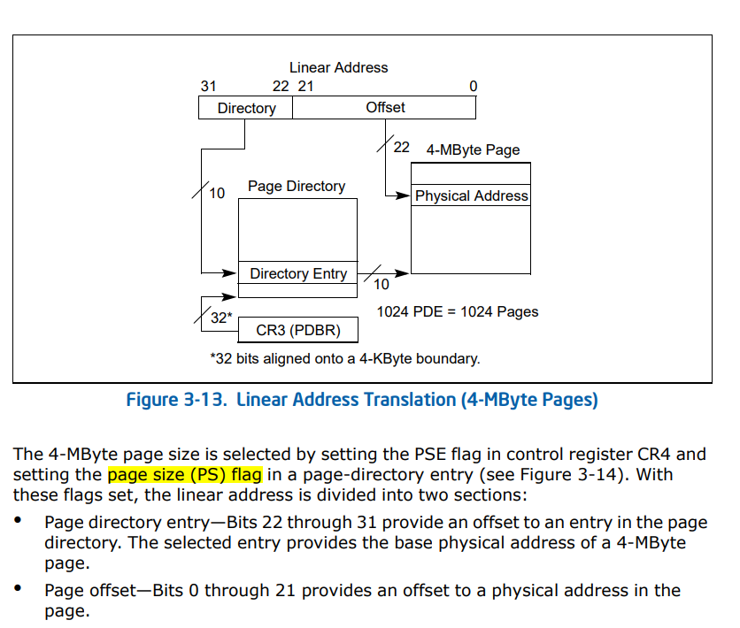
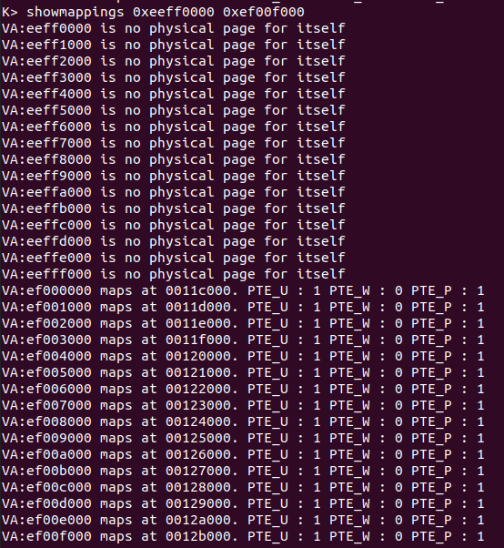
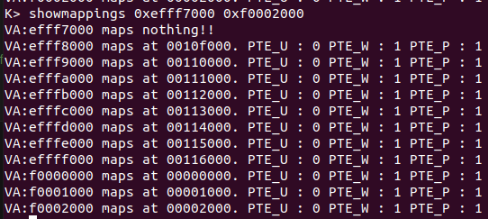
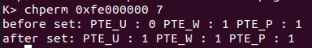
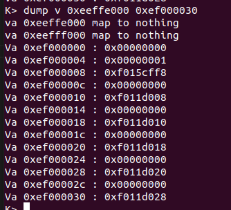
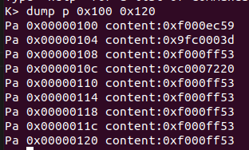
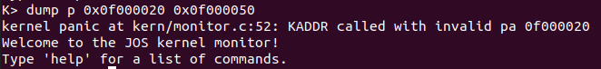

这章主要说本lab中的所有的challenge，能做多少是多少，能理解到多少是多少

# challenge！改进页面使用机制

*Challenge! We consumed many physical pages to hold the page tables for the KERNBASE mapping. Do a more space-efficient job using the PTE_PS ("Page Size") bit in the page directory entries. This bit was not supported in the original 80386, but is supported on more recent x86 processors. You will therefore have to refer to [Volume 3 of the current Intel manuals](https://pdos.csail.mit.edu/6.828/2018/readings/ia32/IA32-3A.pdf). Make sure you design the kernel to use this optimization only on processors that support it!*

我们本lab或者本JOS中使用的页面管理方法是一个二级页表，页表大小是4KB。在进行页表构造过程中使用了很多的物理页面来映射页面，或者说是很多级。

它提示我们能不能寻找一个空间效率更高效的方式（通过使用PTE_PS）。我们可以查询手册——section3.7来看看在intel®64和IA-32中给出的操作。





上图也就是所给出的解决方法，这里采用更大的页，也即一张大小4MB的巨页，相当于是将原先的二级页表所需要内存降低为一张。减少了MMU的查询次数，和内存的访问次数。

对于本次代码中有何处要进行修改——

- 这里页大小变成4MB，所以PGSIZE变为0x400000
- 虚拟地址结构发生变化，前高十位代表了PTE偏移，最后22位表示页面内偏移地址

不过这也带来一个问题——我们知道，页是一个程序运行时内存的分配最小单位，这样一次分配就要给出一张4MB的页面，是不是有些浪费，同时会不会导致可运行进程变少。我想这可能问题不大，现在的软件运行时占用内存都逐渐变大，基础的http服务器如Nginx，基础配置也需要10~20MB的内存，这样反而提高了内存的访问效率，当然这是一些需要经常使用的服务，存在TLB中可以减少换入换出和MMU多级访问的麻烦。

在下面的note中，也提到了在可以使用巨页的情况下，可以允许4KB页和4MB页的混用。处理器分别维护两个TLB，并且对于简单的程序，数据频繁交互的程序可以只使用4KB的页面。

这一题就简单做这么多，因为基于80386的JOS不支持这种操作

# Challenge！扩展JOS内核的监视器命令

- 查看某个范围页面的信息
- 设置权限位
- 转储给定的物理内存的值到指定的虚拟地址

## showmappings

对于showmappings命令，需要提供两个参数，一个起始地址，一个是终止地址

所以对于获取的字符串需要先进行转换为uint32_t，可以使用string.c中提供的库函数`strtol`

```c
lonlong 
   strtol(const char *s, char **endptr, int base)
```

通过源代码中，可以知道——函数会检查s前两位是否为0x，如果是，则会自动去掉；所以不需要手动消除

将输出权限相关信息包装成一个函数

```c
     void printPermission(pte_t now) {
          cprintf("PTE_U : %d ", ((now & PTE_U) != 0));
          cprintf("PTE_W : %d ", ((now & PTE_W) != 0));
          cprintf("PTE_P : %d ", ((now & PTE_P) != 0));
     }
```

```c
int
mon_map(int argc, char **argv,struct Trapframe* tf)
{
	uintptr_t first,second;
	//without the exam of invalid address
	first = strtol(argv[1],NULL,16);
	second = strtol(argv[2],NULL,16);

	first = ROUNDDOWN(first,PGSIZE);
	second = ROUNDDOWN(second,PGSIZE);
	while(first <= second){
		//find the pte of the page
		pte_t* mapper = pgdir_walk(kern_pgdir,(void*)first,0);
		cprintf("VA:%08x ",first);
		if(mapper){
			//not null
			if(*mapper & PTE_P){
				//if exsits
				cprintf("maps at %08x. ",PTE_ADDR(*mapper));
				printPermission(*mapper);
				cprintf("\r\n");
			}
			else{
				//not exsit
				cprintf("maps nothing!!\r\n");
			}
		}
		else{
			//return null has two reasons: not create or can't alloc.
			//if because of alloc, the page_alloc() will throw a panic.we can do nothing
			//if because of not create, just print the info to the teminal
			cprintf("is no physical page for itself\r\n");
		}
		first += PGSIZE;
	}
	return 0;
}
```

权限位的获取，主要通过每个PTE的结构（低12位是权限位，高位为地址），所以拿到某个虚拟地址对应的PTE，那么其他的就迎刃而解了

下面看一下运行结果，主要查看之前进行映射的三个区域

- UPAGES上下部分

  

  UPAGES的虚拟地址为0xef000000，可以发现其前没有被映射，其后被映射，且用户可以进行读，这和我们在`mem_init`中设置的一样

- KSTACKTOP附近

  在映射时，我们其实就是在KSTACKTOP上映射了8个页面

  

  因为，KSTACKTOP和0xf0000000是相连的，所以其后仍然有映射的页面

  且权限是只对内核可读可写

## 显示设置、清除或者设置当前地址空间的权限

这里对这个“当前地址空间”，我也没有特别好的理解是什么意思。所以姑且按照当前地址空间指那些有相应的虚拟地址的空间。也有可能是区分于linux中的user和root用户的关系，但是这里我们只有一种用户，所以也不去考究那么多

这里采用在命令命名和指令结构方面，采用linux中chmod的相应思想。

```c
chperm addr perm
//其中perm表示权限设置，按照位与的方式来设置
#define PTE_P		0x001	// Present
#define PTE_W		0x002	// Writeable
#define PTE_U		0x004	// User
//所以chperm addr 7 表示对addr所在页面设置为页面存在，用户和内核都可读写
```

也即对原有权限的低三位先清空，再或上perm

```c
int
mon_chperm(int argc, char** argv, struct Trapframe* tf)
{
	uintptr_t addr = strtol(argv[1],NULL,16);
	uint32_t perm = strtol(argv[2],NULL,10);

	pte_t* pte = pgdir_walk(kern_pgdir,(void*)addr,0);
	if(pte){
		//not null
		cprintf("before set: ");
		printPermission(*pte);
		cprintf("\r\n");

		*pte = (*pte & ~(uint32_t)7) | perm;
		cprintf("after set: ");
		printPermission(*pte);
		cprintf("\r\n");
	}
	else{
		cprintf("%08x is no physical page for itself\r\n",addr);
	}
	return 0;
}
```

这里多说一点，我们的代码又是进行编译会通过很严格，比如我这里在14行中没有加上括号也报了错误，这其实是编译器的建议。我们可以将makefile文件中的-Werror删除就行，但是可能因为这是对于内核的编程，所以lab加上这条选项也是有考虑的。

之后我们运行，就可以看到修改成功。



## 转储(dump)对应物理地址或者虚拟地址中的内容

这里先解释一下dump，转储的意思，其实好好理解一下词语的意思也能明白——就是将数据转移储存在某某里。在计算机也就表示将，一些数据保存到文件中，或者输出到I/O。这里我们还没有建立文件系统，所以就是进行输出到I/O上

对于虚拟地址，我们直接访问就行；对于物理地址，去访问他所对应的虚拟地址

在这里，起初我一直在思考，如果我访问的这个物理地址，不存在对应的虚拟地址怎么办，后来我才意识到，这是错误的。我们即使是在处理内核，也不应该能够直接处理到某个物理地址才是，记得之前在创建完成虚拟内存并完成映射之后，有的内存是不允许内核进行修改的，或者说，即使是内核来说，对于某些内存也是无能为力的。或许还有其他的原因，我的理解是如此

题目中还说，注意当页面发生切换时会发生的变化。所以我们可以用`pgdir_walk`去寻找对应的页面，如果无法找到，那就是没有相对应的映射的界面，防止fault等错误的发生

```c
int mon_dump(int argc, char** argv, struct Trapframe* tf)
{
	uint32_t begin = strtol(argv[2],NULL,16);
	uint32_t end = strtol(argv[3],NULL,16);
	//align the address(the 32bit machine)
	begin = ROUNDUP(begin,4);
	end = ROUNDDOWN(end,4);
	pte_t* pte;
	if(argv[1][0]== 'p'){
		while(begin <= end){
			pte = pgdir_walk(kern_pgdir,(void*)KADDR(begin),0);
			if(!pte){
				cprintf("pa 0x%08x map to nothing or no permission\r\n",KADDR(begin));
				begin = ROUNDUP(begin+1,PGSIZE);
			}
			else{
				for(;begin<=end && begin < ROUNDDOWN(begin,PGSIZE)+PGSIZE;begin+=4){
					cprintf("Pa 0x%08x content:0x%08x\r\n",begin,*(uint32_t*)KADDR(begin));
				}
			}
		}
	}
	else if(argv[1][0] == 'v'){
		while(begin <= end){
			pte = pgdir_walk(kern_pgdir,(void*)begin,0);
			if(!pte){
				cprintf("va 0x%08x map to nothing\r\n",begin);
				begin = ROUNDUP(begin+1,PGSIZE);
			}
			else{
				for(;begin<=end && begin < ROUNDDOWN(begin,PGSIZE)+PGSIZE;begin+=4){
					cprintf("Va 0x%08x : 0x%08x\n", begin, *((uint32_t*)begin));
				}
			}
		}
	}
	return 0;
}
```

这里的边界条件一定是`begin<=end && begin < ROUNDDOWN(begin,PGSIZE)+PGSIZE`

对于验证的话，虚拟地址我使用UPAGE前后的虚拟地址



物理地址随便选取了有对应虚拟地址映射的地址和无虚拟地址映射的位置





这里在非映射位置，会由KADDR抛出异常，同时重启monitor

# challenge！空间布局方案

插眼
